# :book: Installing and configuring Jenkins

## Goal 
- Provision Jenkins in a Virtual Machine running on ubuntu Server 22.04 "jammy".
- The Jenkins instace must be running as a docker container.
- Set up four agent nodes running as docker containers too.
- All of the containers should be running on the same docker network.
- Use one of the node instances as Ansible controller.

## Requiremens
According to [Jenkins on Docker](https://www.jenkins.io/doc/book/installing/docker/) documentation, the requirements demand at least 256MB of RAM and 10 GB of disk.

The resources used in this lab, presented in this document, are configured in the following way:

**Virtual Hardware**
- 8GB of RAM.
- 4 CPUs.
- 10GB of the bootable disk.
- 30GB of the data disk.
- Intel Nic Network device.

**Software**
- Virtual Machine running on Oracle VirtualBox.
- Ubuntu 22.04 server ("jammy") operating system.
- git 2.25.1 is already installed with the system.
- Python 3.8.10 is already installed with the system.
- Jenkins 2.387
- Docker 20.10.23


In case your Virtual Machine requires additional disk space, follow the directions below to add more space:

## Prepare Jenkins storage

1. [Create a new Ubuntu 22.04 Virtual Machine in VirtualBox](https://github.com/asgdevops/virtualization/blob/main/virtualbox/vm/ubuntu2204/README.md)
2. Execute the steps found at [Adding storage ](adding_storage/README.md)
3. Create jenkins persistent directories

  - Jenkins app data
   
    ```bash
    sudo mkdir -p /data/jenkins_home && sudo chown -R $USER:docker /data/jenkins_home ;
    ```

- Jenkins certificates

    ```bash
    sudo mkdir -p /data/jenkins_cert/ca ;
    sudo mkdir -p /data/jenkins_cert/client ;
    sudo chown -R $USER:docker /data/jenkins_cert ;
    ```

  
# Architecture

The solution proposed in this document consists of a Controller - Worker model running on Docker containers. 

The containers run on a Docker network where the Jenkins controller and nodes run. Each node is set up as a permanent Jenkins agent but running on an individual docker container.

The application data is saved in a docker volume to keep it persistent.

Each node has a different operating system:
- The Alpine node functions as the Ansible controller.
- Whereas the CentOs, Debian and Ubuntu are the worker nodes.

  ||
  |:--:|
  |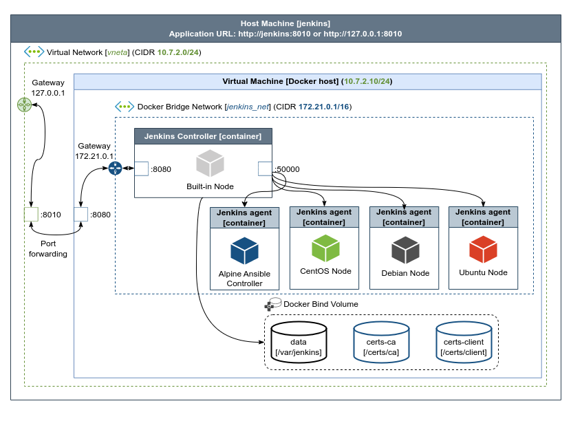|
  |Fig 1. Jenkins Architecture Model|

# Installation 

Jenkins installation has been automated by combining BASH shell scripting, with Docker files and docker-compose.yaml files.

The aim is to implement the Continuous Integration process from the beginning until the end of the project.

## Scripts usage

|No.|Script name|Purpose or function|Links to|
|--:|--|--|--|
|1|[install_jenkins.sh](jenkins/install_jenkins.sh)|Jenkins installer for Ubuntu 22.04 systems. <br/> 1. Creates the `.env` environments variable file. <br/> 2. Installs Docker Engine. <br/> 3. Configures the persistent volumes directories. <br/> 4. Creates the SSH key pair (ed25519) to keep the jenkins controller and nodes working together. <br/> 5. Launches the `docker-compose.yml` file to build and run the Jenkins containers.|--> docker-compose.yml file|
|2|[docker-compose.yml](jenkins/docker-compose.yml)|1. Builds the images of the Jenkins controller and agent nodes. <br/> 2. Creates the containers from the docker images. <br/> 3. Creates the Docker network. <br/> 4. Binds the docker volumes for persitent data.|--> jenkins.Dockerfile <br/> --> centos.Dockerfile <br/> --> debian.Dockerfile <br/> --> ubuntu.Dockerfile|
|3|[alpine.Dockerfile](jenkins/alpine.Dockerfile)|Builds the alpine:3.17 controller node. <br/> 1. Sets up the jenkins user with root privileges. <br/> 2. Installs and configures SSHD. <br/> 3. Installs git, openJDK 11, Ansible and Terraform. ||
|4|[centos.Dockerfile](jenkins/centos.Dockerfile)|Builds the centos:7 agent node. <br/> 1. Sets up the jenkins user with root privileges. <br/> 2. Installs and configures SSHD. <br/> 3. Installs git and openJDK 11.||
|5|[debian.Dockerfile](jenkins/debian.Dockerfile)|Builds the debian:11 agent node. <br/> 1. Sets up the jenkins user with root privileges. <br/> 2. Installs and configures SSHD. <br/> 3. Installs git and openJDK 11.||
|6|[ubuntu.Dockerfile](jenkins/ubuntu.Dockerfile)|Builds the ubuntu:22.04 agent node. <br/> 1. Sets up the jenkins user with root privileges. <br/> 2. Installs and configures SSHD. <br/> 3. Installs git and openJDK 11.||

The process below will be replicated on the AWS EC2 instance.
As a result, follow the steps below to complete the Jenkins installation.

# Steps

1. Ensure the Ubuntu VM is running and start a new SSH session.

    ```bash
    ssh ansalaza@localhost -p 2210
    ```

    ||
    |:--:|
    |Figure 1 - SSH log into VM |

2. Clone the [asgdevops/cd-project-jenkins](https://github.com/asgdevops/cd-project-jenkins.git) GitHub repository

    ```bash
    git clone https://github.com/asgdevops/cd-project-jenkins.git

    cd cd-project-jenkins
    ```

    ||
    |:--:|
    |Figure 2 - clone cd-project-jenkins repository |

3. Ensure the user account you are using has sudo privileges.

    ```bash
    sudo cat /etc/os-release
    ```

    ||
    |:--:|
    |Figure 3 - SSH log into VM |

4. Execute the `install_jenkins.sh` shell script.

    ```bash
    ./install_jenkins.sh
    ```

    _Depending on the VM spped, it shall take between 5 to 20 minutes to complete._

      |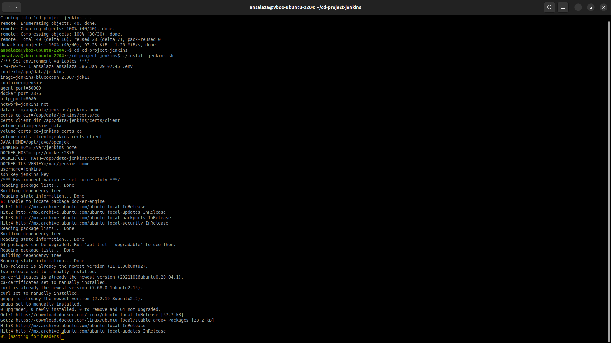|
    |:--:|
    |Figure 4a - install_jenkins.sh part I |

    When the installation process gets completed, you should see five containers running:

    |No.|Container|Descriptions|
    |--:|--|--|
    |1|jenkins|Jenkins master controller|
    |2|alpine-controller|Alpine agent working as the Ansible master controller|
    |3|centos-agent|CentOS 7 agent node|
    |4|debian-agent|Debian 11 ("bullseye") agent node|
    |5|ubuntu-agent|Ubuntu 22.04 ("jammy") agent node|

    There should be also:

    |No.|Resource name|Description|Cmd|
    |--:|--|--|--|
    |1|jenkins_net|Docker bridge network resource|`sudo docker network ls`|
    |2|jenkins_data|Docker persistent volume bind to `/app/data/jenkins/jenkins_home` directory|`sudo docker network ls`|

    |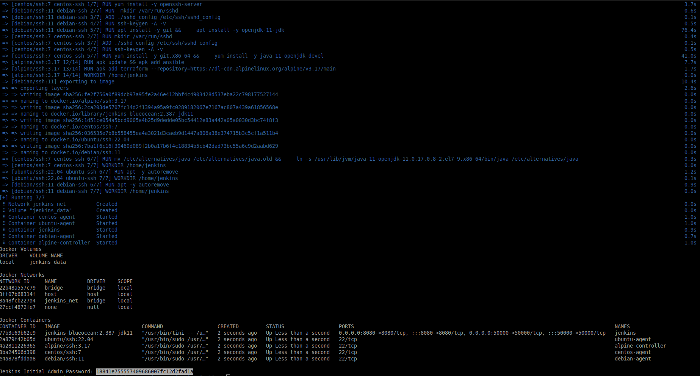|
    |:--:|
    |Figure 4b - install_jenkins.sh part II |


<br/>

# Configuring Jenkins Part I: Admin Credentials and First plugins

5. Get the **initial Admin Password** from the logs.

- Option 1: Opening the `/var/jenkins_home/secrets/initialAdminPassword` file.

  ```bash
  sudo docker exec -it jenkins cat /var/jenkins_home/secrets/initialAdminPassword
  ```

  ||
  |:--:|
  |Figure 5 - Jenkins initial Admin Password from file |

- Option 2: Gather it from the container log.

  ```bash
  docker logs jenkins
  ```

  |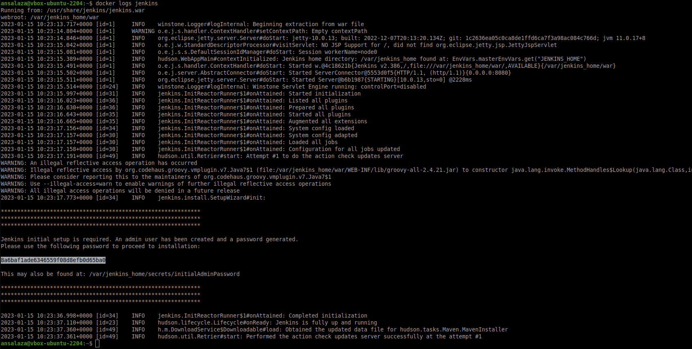|
  |:--:|
  |Figure 6 - Jenkins initial Admin Password from log|

6. On **Oracle VM virtualBox Manager**, use the virtual network port forwarding rules to map the host port 8010 to the VM port 8080.

   - Open **Oracle VM VirtualBox Manager** and click on **Tools** > **Preferences**
   - On the **VirtualBox - Preferences** screen, select **Network** from the left pane.

    ||
    |:--:|
    |Figure 6a - VirtualBox - Preferences|

   - Select your virtual network and click on the **Edits Selected NAT Network** icon on the right side of the screen.

   - On the **NAT Network Details** screen click on **Port Forwading**

    |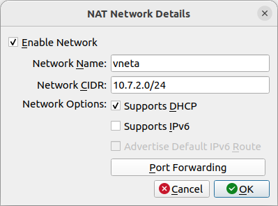|
    |:--:|
    |Figure 6b - NAT Network Details|

   - Add a new port forwarding rule with as shown in the table below:

     |Name|Protocol|Host IP|Host Port|Guest IP|Guest Port|
     |--|--|--|--|--|--|
     |http_vm1|TCP|127.0.0.1|8010|10.7.2.10|8080|

    |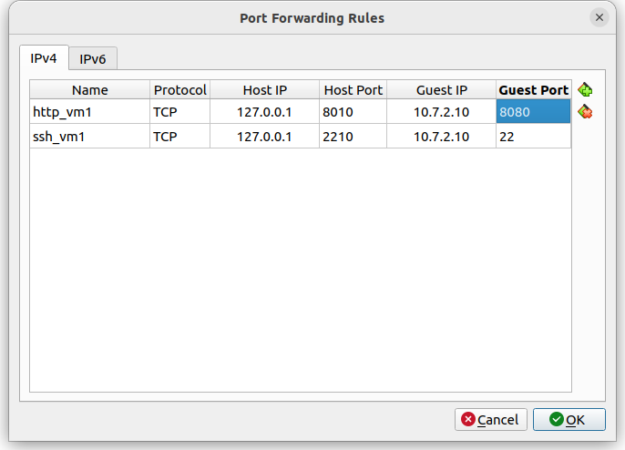|
    |:--:|
    |Figure 6c - Port Forwarding Rules|


7. Login to Jenkins application in the web browser.
   - Open a new Web Browser and go to `http://localhost:8080`
   - Type the admin password taken from the jenkins Docker container

       |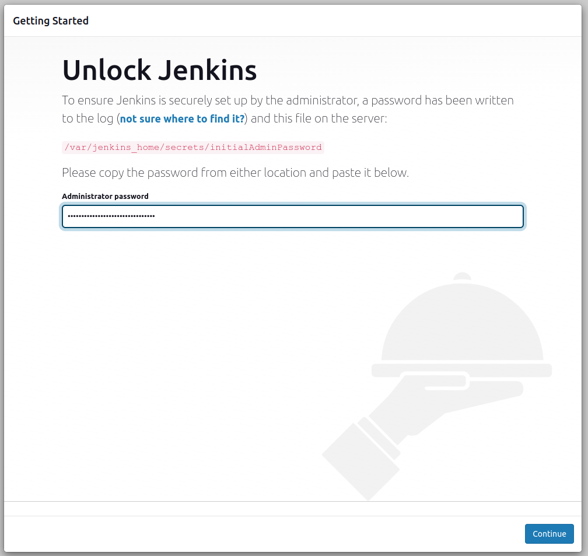|
       |:--:|
       |Figure 7 - Unlock Jenkins|

   - Click on the **Install suggested plugins** button

       |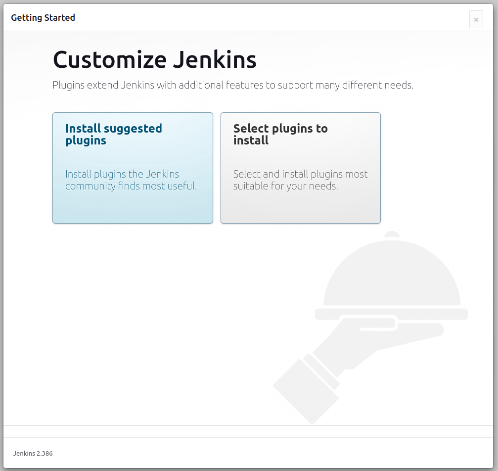|
       |:--:|
       |Figure 7a - Customize Jenkins|

   - Monitor the progress of the plug ins installation

       ||
       |:--:|
       |Figure 7b - Getting Started|

   - Input the **Admin User** credentials

       |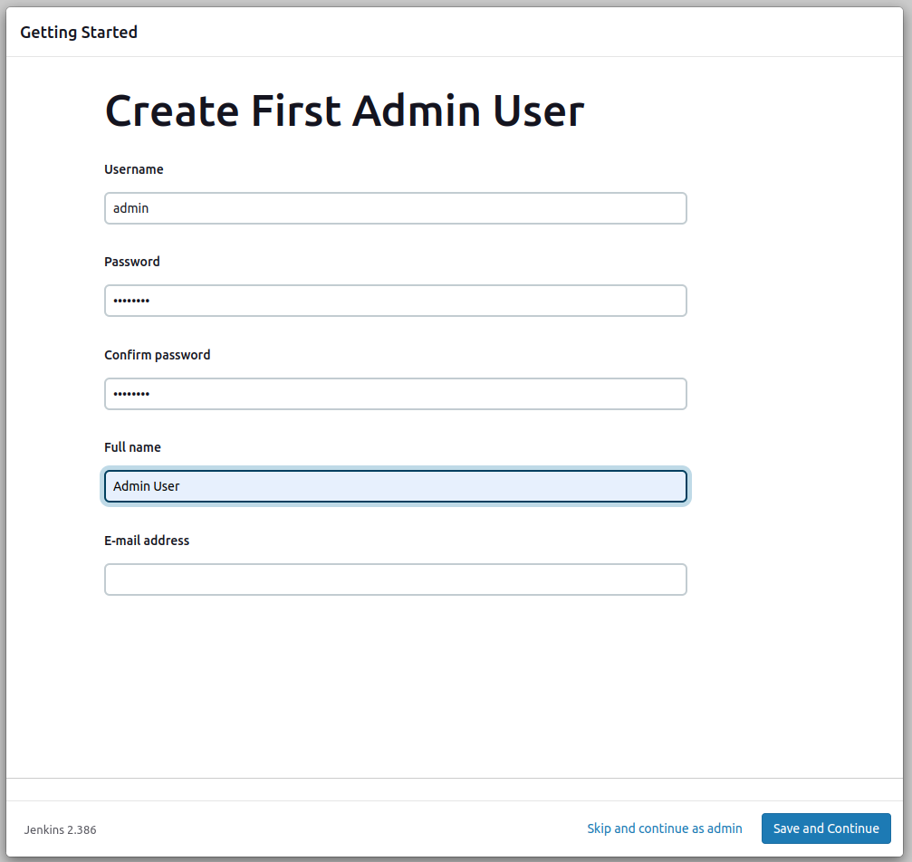|
       |:--:|
       |Figure 7c - Create First Admin User|

   - Set up the Jenkins Application URL and port number

       ||
       |:--:|
       |Figure 7d - Instance Configuration|

   - After getting the confirmation page, click on **Start using Jenkins**

       ||
       |:--:|
       |Figure 7e - Jenkins is ready!|

   - Now the Jenkins Dashboard screen is open

       |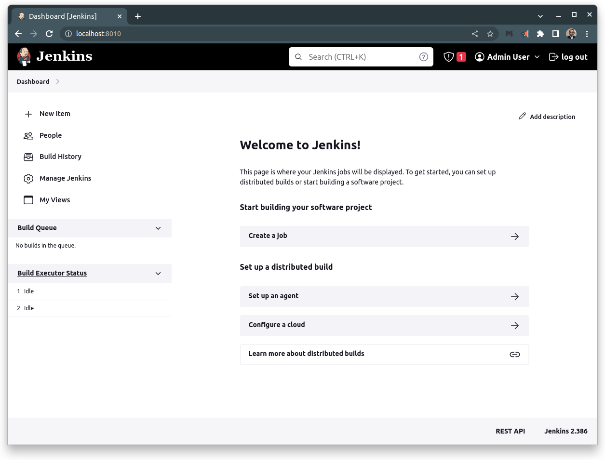|
       |:--:|
       |Figure 7f - Jenkins Dashboard|


# Configuring Jenkins Part II: Set up the Agent Nodes
8. Add the **SSH Agent** and the **CloudBees** plugins.

    |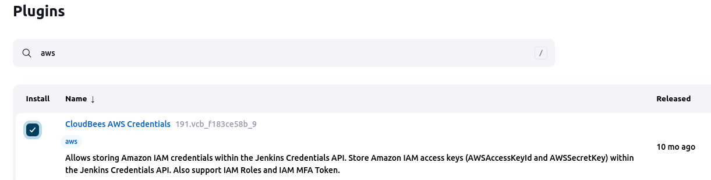|
    |:--:|
    |Figure 8a - Jenkins AWS CloudBeess plugin|

    |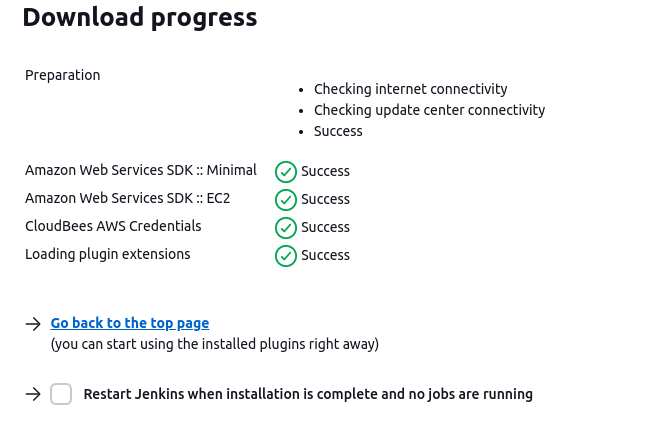|
    |:--:|
    |Figure 8b - Jenkins AWS CloudBeess plugin|

9. Add the **AWS Account**credentials.

    |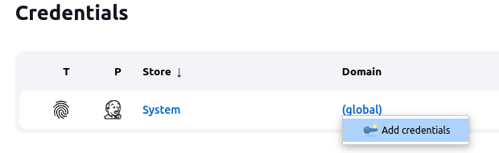|
    |:--:|
    |Figure 9a - Jenkins AWS credentials|

    |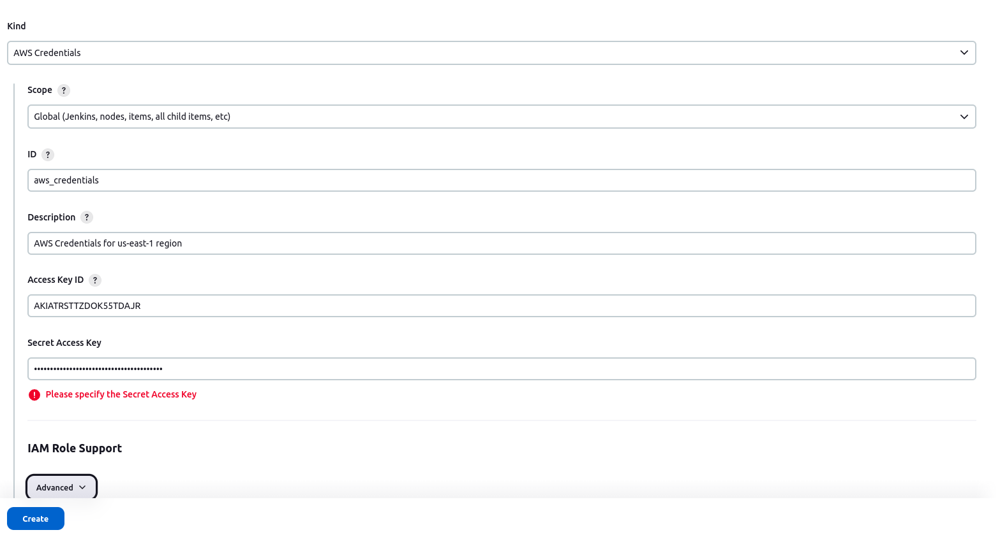|
    |:--:|
    |Figure 9b - Jenkins AWS Credentials|

    |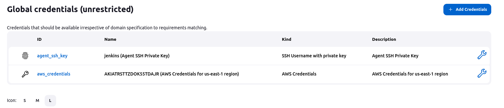|
    |:--:|
    |Figure 9c - Jenkins AWS Credentials|


10. Add the Alpine, CentOS, Debian and Ubuntu nodes accordingly.

    - Go to **Manage Jenkins** 

      |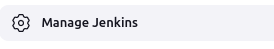|
      |:--:|
      |Figure 10a - Manage Jenkins|

    - **Manage nodes and clouds**

      ||
      |:--:|
      |Figure 10b - Manage Nodes and Clouds|

    - Click on **+ New node**

      ||
      |:--:|
      |Figure 10c - New Node|

    - Enter the **Node Name** and click on **Create**

      ||
      |:--:|
      |Figure 10d - Node Name|

      _Jenkins allow to copy from another node to speed up filling up the fields._

    - Select Type **Permanent Agent**
    - Click on **Create**
    - Depending on the node, type the corresponding node name [Alpine || Centos || Debian || Ubuntu]
    - Number of Executors: **3**
    - Remote root directory: `/home/jenkins`. _The reason of this, is because when building the docker images, jenkins user was created within its SSH keys._
    - In lables enter the following:
      - For Alpine controler: **`alpine_controller`**.
      - For the rest of the agents: **`[centos||debian||ubuntu]_worker`**.
    - Usage: **Only build jobs with label expressions matching this node**.
    - Launch method: Launch agents via SSH.

      |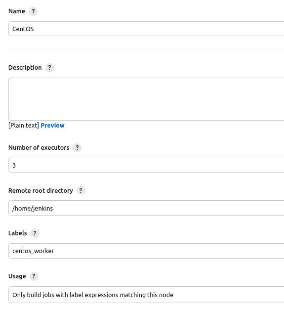|
      |:--:|
      |Figure 10e - Permanent Agent|

    - On Credentials, it this is the first time you input the credential :
      - click on **+ Add**
      - On the Jenkins Credentials Provider: Jenkins Screen.
        - Domain: **Global credentials (unrestricted)**
        - Kind: **SSH Username with pivate key**
        - Scope: **Global (Jenkins, nodes, items, all child items, etc.)**
        - Id: **agent_ssh_jenkins**
        - Description: **Jenkins Agent SSH Private Key**
        - Username: **jenkins**
        - Private Key: **selected**
        - Go to your terminal and open the **`jenkins_key`** file and copy its contents.
        - Go back to the Jenkins Credential screen, and click on the **Add** button. 
        - Paste the private SSH key.
        - **Save**.
        - This takes you back to the previous screen, so choose the ssh credentials just entered.
        - Host Key verification strategy: **Non verifying Verification Strategy**.
        - Availability: **Keep this agent online as much as possible**. 

        |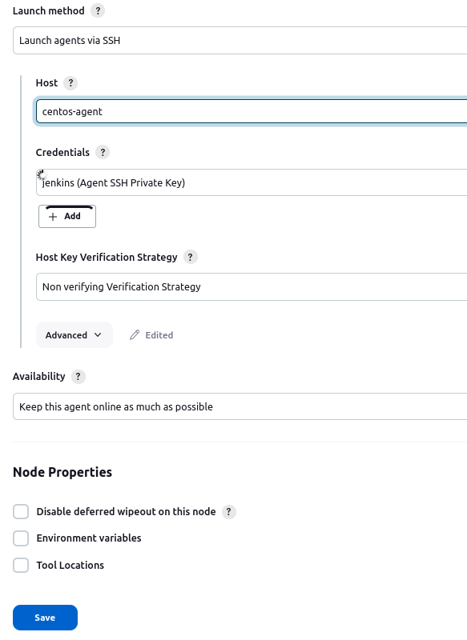|
        |:--:|
        |Figure 10f - Permanent Agent|

      - At the end you should see the screen with all the agents summary.

        |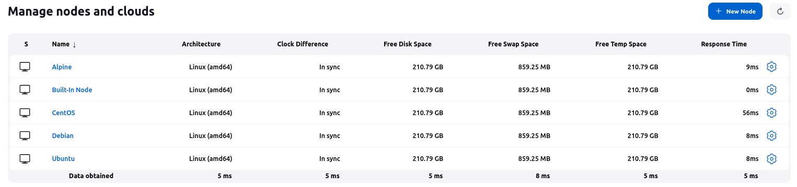|
        |:--:|
        |Figure 10g - Permanent Agent|


11. Run the [ansible_hello.pipeline](https://github.com/asgdevops/cd-project-ansible/blob/main/ansible_hello.jenkinsfile) to the a simple test.

- Go to Jenkins **Dashboard**
- Click on **+ New Item**
- Type `ansible_version.pipeline` 
- Select **Piepline** and click **OK**
- Fill in the follwing fields
  - Check **Discard Old builds** to save disk space.
  - Choose the number of days or runs you would like to keep. 

    |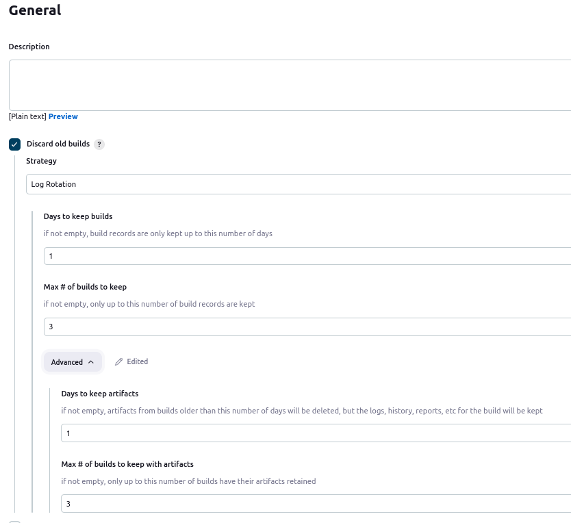|
    |:--:|
    |Figure 11a - Permanent Agent|

  - In the Pipeline section select the following:

    - Definition: **Pipeline Script from SCM**
      - SCM: **Git**
      - Repository URL: (your repository) in this example [asgdevops/ansible](https://github.com/asgdevops/cd-project-ansible)
      - Branch Specifier (blank for 'any'): ***/main**
      - Script Path: (your pipeline script name) in this example [ansible_hello.jenkinsfile](https://github.com/asgdevops/cd-project-ansible/blob/main/ansible_hello.jenkinsfile)
      - **Save**.


      |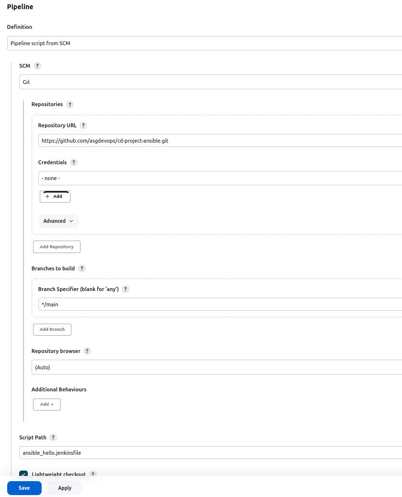|
      |:--:|
      |Figure 11b - Pipeline|

  - Build and monitor the job progress.

    |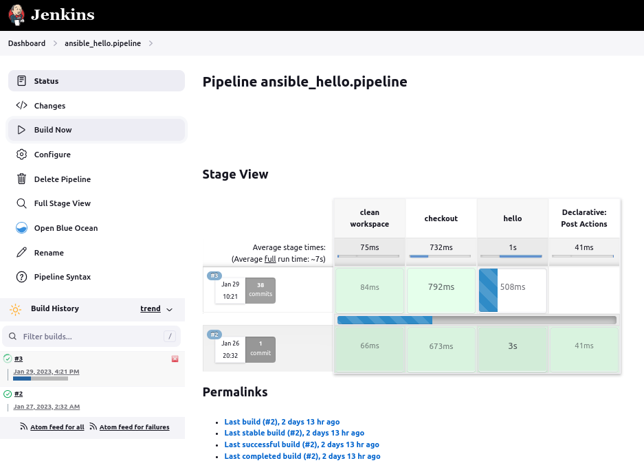|
    |:--:|
    |Figure 11c - Permanent Agent|

# :movie_camera: Set up jenkins recording
- [Set up Jenkins on AWS EC2](https://youtu.be/cWMcIWrqJ3U)

# :scroll: Scripts
|Script name| Description|
|--|--|
|[.env](jenkins/.env)|Environment variables generated by the `install_jenkins.sh` script.|
|[install_jenkins.sh](jenkins/install_jenkins.sh)|Jenkins on Docker installer. Creates the directory structure used by the Docker Volumes.Installs Docker on the system and calls the `docker-compose.yml` script. It also creates the jenkins SSH keys to connect between the controller and the agents.|
|[docker-compose.yml](jenkins/docker-compose.yml)|Docker orchestrator builder. Builds the docker images of the jenkins controller and its nodes. Creates the Docker network, and bins the docker volumes for persitent data.|
|[alpine.Dockerfile](jenkins/alpine.Dockerfile)|Builds the Alpine 3.17 agent node. It functions as the Ansible Master controller for the remianing nodes. It also has the Terraform packages to use it as a provisioning instance.|
|[centos.Dockerfile](jenkins/alpine.Dockerfile)|Builds the CentOS 7 agent node.|
|[debian.Dockerfile](jenkins/alpine.Dockerfile)|Builds the Debian 11 agent node.|
|[ubuntu.Dockerfile](jenkins/alpine.Dockerfile)|Builds the ubuntu 22.04 agent node.|
|[jenkins.Dockerfile](jenkins/alpine.Dockerfile)|Builds the Jenkins controller node version 2.387 with blueocean plugins.|
|[sshd_config](jenkins/sshd_config)|Configuration parameters file to set up SSHD on each of the aget nodes.|

<br/>

# :movie_camera: Set up jenkins recordings
- [jenkins setup 01](https://youtu.be/Wmkua_rMEa0)
- [jenkins setup 02](https://youtu.be/COMh0HkeFoo)

# :page_facing_up: Log file examples
- [ansible_hello.log](logs/ansible_hello.log)

# :books: References
- :link: [Installing Jenkins - Docker](https://www.jenkins.io/doc/book/installing/docker/)
- :link: [Installing Jenkins](https://www.jenkins.io/doc/book/installing/)
- :link: [Jenkins dockerhub official image](https://hub.docker.com/r/jenkins/jenkins)


  - ### Installing Jenkins on 
    - :link: [Linux](jenkins_install_linux.md)
    - :link: [macOS](jenkins_install_macos.md)
    - :link: [Windows](jenkins_install_windows.md)
    - :link: [Docker](docker/README.md)

## Repositories used in this process
- :link: [asgdevops/cd-project-ansible](https://github.com/asgdevops/cd-project-ansible)
- :link: [asgdevops/pipelines](https://github.com/asgdevops/pipelines)
