# Adding storage 

## Add new Hard Disk and attach it to the VM
1. Ensure your VM is powered off.
2. On Oracle VM VirtualBox Manager select your Virtual Machine.
3. Click on the Settings button.
4. Select the Storage menu.
5. On the **Storage Devices** click the **Adds Hard disk** icon next to the **Controller SATA:**. 

    ||
    |:--:|
    |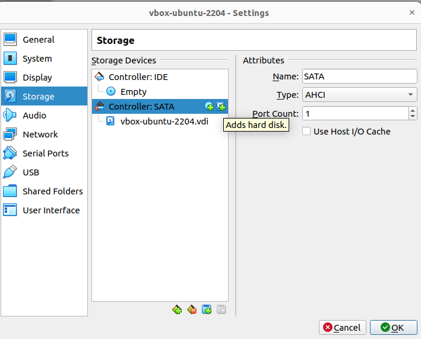|
    |Fig.1 - VM Settings - Storage|

6. Click on the **Create** button.

    ||
    |:--:|
    |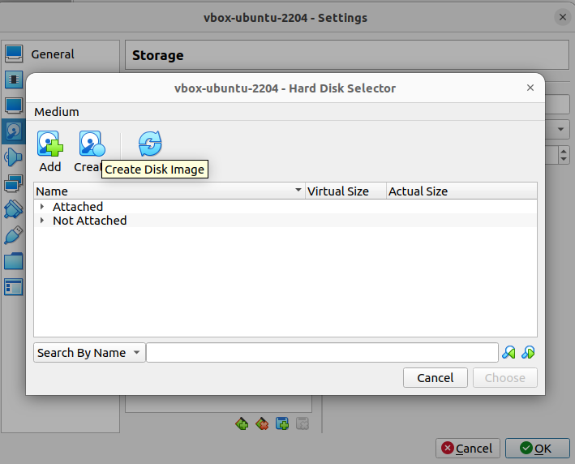|
    |Fig.2 - VM Settings - Hard Disk Selector|


7. Select the **VDI (VirtualBox Disk Image)** option and click **Next**.

    ||
    |:--:|
    |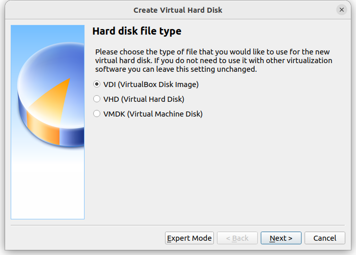|
    |Fig.3 - Create Virtual Hard Disk - Hard disk file type|

8. Choose **Dinamically Allocated** and click **Next**.

    ||
    |:--:|
    |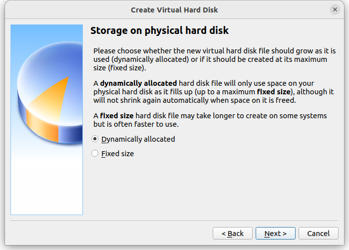|
    |Fig.4 - Create Virtual Hard Disk - Storage on physical hard disk|


9.  Type the disk size and click on **Create**.

    ||
    |:--:|
    |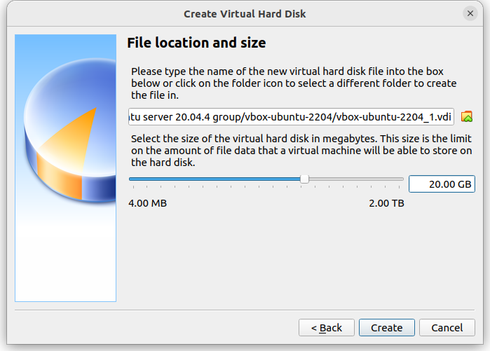|
    |Fig.5 - Create Virtual Hard Disk - File location and size|

10. On the **Hard Disk Selector** screen, select your new disk and click on the **Choose** button.

    ||
    |:--:|
    |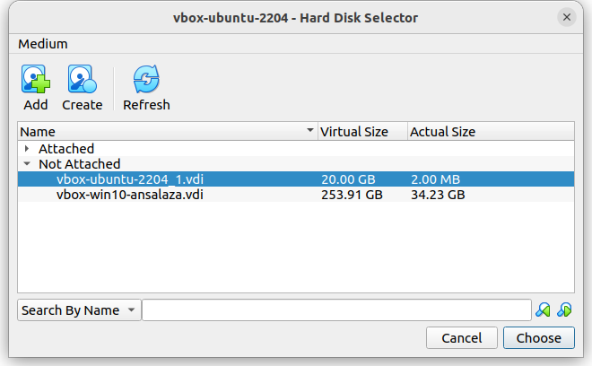|
    |Fig.6 - Hard Disk Selector|

11. Save the changes.

    ||
    |:--:|
    |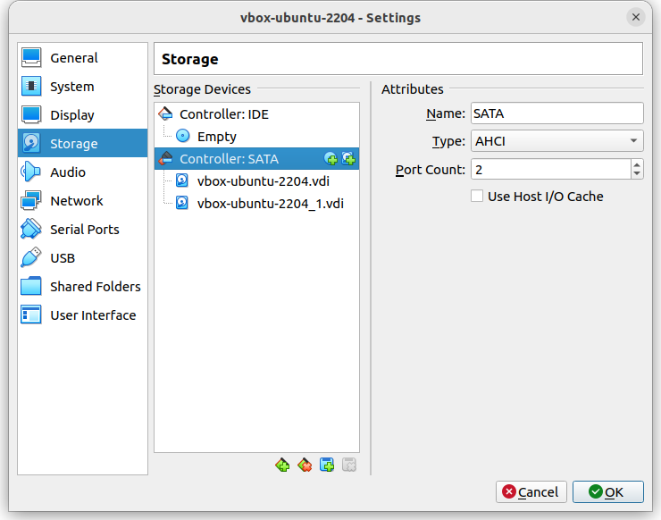|
    |Fig.7 - Settings|

12. Startup your VM.


## Incorporate the new Hard Disk into the Linux system

1. Open a terminal and login to the VM host.
2. Verify the current partitions by executing. 

    ```bash
    sudo fdisk -l 
    ```

    ||
    |:--:|
    |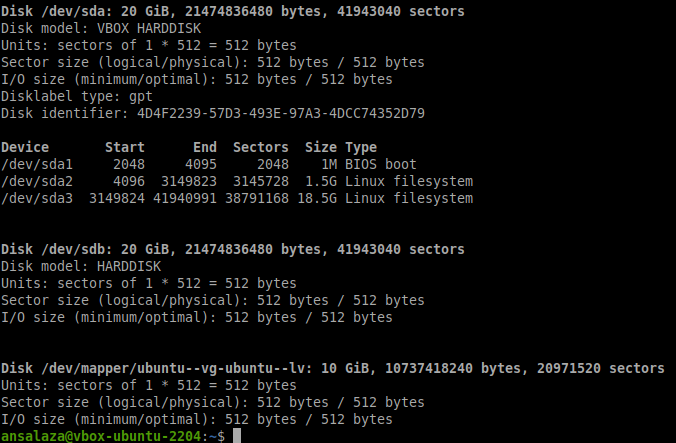|
    |Fig.8 - Settings|

    - The Disk devices are named `/dev/sda` for the first hard disk, `/dev/sdb` for the second one, `/dec/sdc` for the third, and so on.
    - The partitions are named `/dev/sda[partition number]`. For example: 

      |Partition|Type|
      |--|--|
      |/dev/sda1|BIOS boot|
      |/dev/sda2|Linux filesystem|
      |/dev/sda3|Linux filesystem|

    - So there is a new Hard Disk `/dev/sdb` with 20 GB size, which partitions are to be created.

3. To create a new partition for disk `/dev/sdb` run:

    ```bash
    sudo fdisk /dev/sdb
    ```

    ||
    |:--:|
    |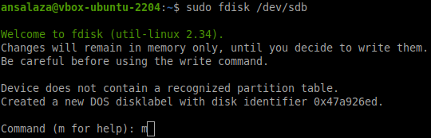|
    |Fig.9 - Settings|

4. Type `m` and hit ENTER to display the help menu.
5. After that, input `n` to create a new partition.
6. Now select the defaults: 
   - `p` to create a primary partition, then ENTER.
   - `1` to create the partition number 1, then ENTER.
   - Hit ENTER to select the default 'First sector' number. (_in this example 2048_)
   - Again just press ENTER to choose the 'Last sector' number.  

    ||
    |:--:|
    |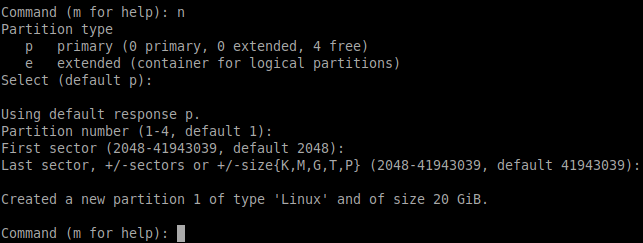|
    |Fig.10 - Settings|

7. Type `w` and ENTER to save the changes.

    ||
    |:--:|
    |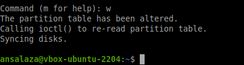|
    |Fig.11 - Settings|

8. Verify the new partitions by running the `lsblk` command.

    ||
    |:--:|
    |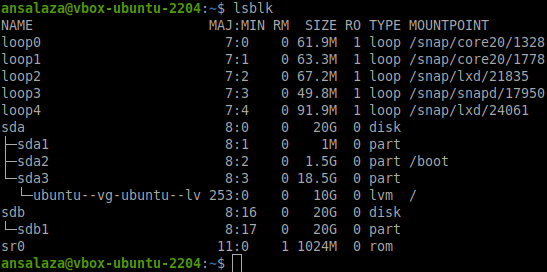|
    |Fig.12 - Settings|

9. Format the new partition `/dev/sdb1`

    ```bash
    sudo mkfs.ext4 /dev/sdb1
    ```

    ||
    |:--:|
    |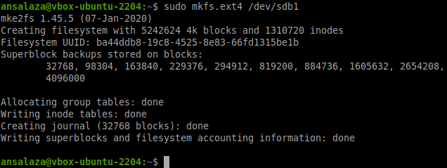|
    |Fig.13 - Settings|

10. Mount the partition already formated to `/data` directory.

    ```
    sudo mkdir /data
    sudo mount -t ext4 /dev/sdb1 /data
    ```
    ||
    |:--:|
    |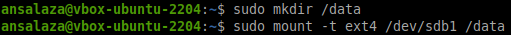|
    |Fig.14 - Settings|

11. Add the partition information to the `/etc/fstab` file for the system to mount to the `/dev/sdb1` partition to the `/data` directory at boot time.

    - Edit the `/etc/fstab` file with `vi` or `nano` editor.

      ```bash
      sudo vi /etc/fstab
      ```

    - Add the lines below:

      ```bash
      # Hard disk
      /dev/sdb1 /data ext4 defaults 0 0
      ```

      Where:
      - `# Hard disk` is just a comment.
      - `/dev/sdb1` is the first partition for the second hard disk.
      - `/data` is the directory where the partition is mounted.
      - `ext4` is the file system format or type.
      - `defaults` is the default mount option.
      - First `0` is the `dump` option, used for the system to decide when to do a backup. Its possible values are 0 and 1. Where 0 means OFF, whereas 1 means ON. 
      - Second `0` is the `pass` parameter, used to check the file systems order. 0 means it is turned OFF. 

    ||
    |:--:|
    |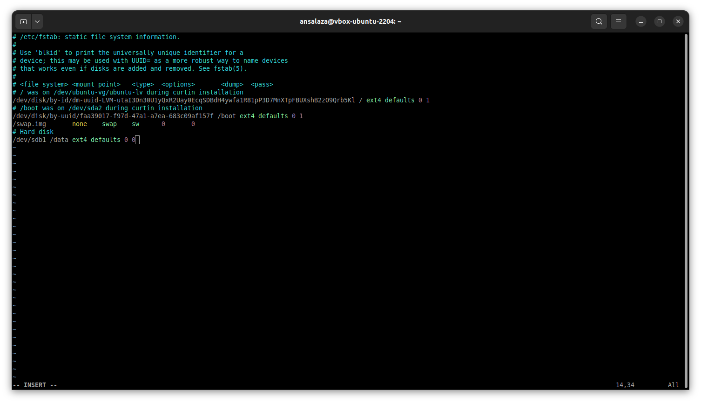|
    |Fig.14 - Settings|

    - Save and exit.

12. Other way to verify the partition is mounted is by running `df -h` command.

    ||
    |:--:|
    |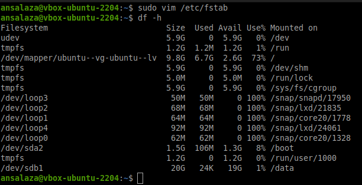|
    |Fig.15 - Settings|

13. In example: `df -hP /data`

    ||
    |:--:|
    |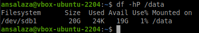|
    |Fig.16 - Settings|

