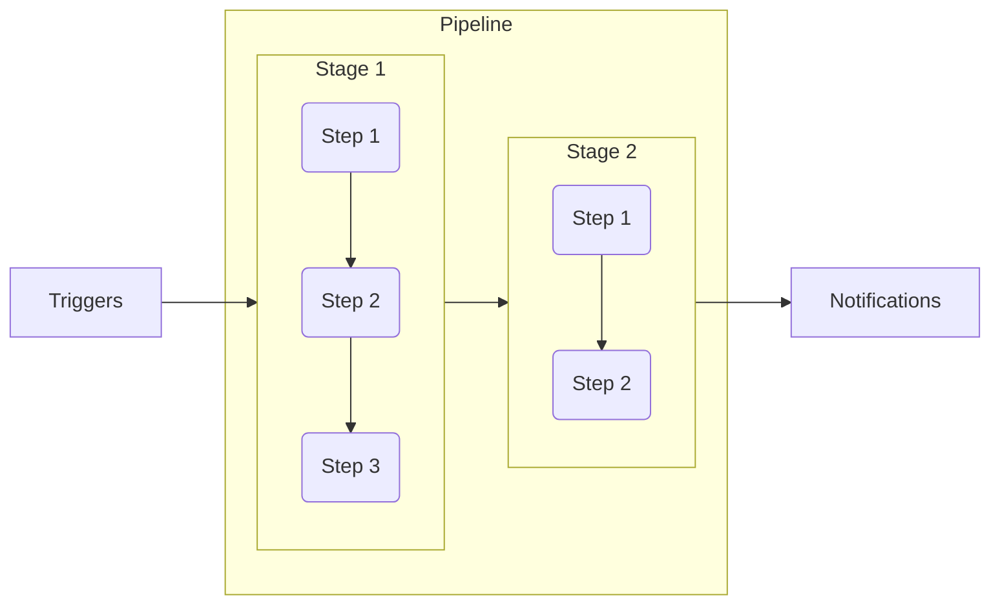

# :book: Jenkins Pipeline

> _A **pipeline** is a sequnece of automated operations that usually represents a part of the software delivery and quality assurance process. It can be seen as a chain of scripts..._
(Leszko, 2022, p.184)
 


_(Leszko, 2022, p.185)_

<br/>

# Declarative Pipeline Syntax Example

```groovy
pipeline {
    agent any 
    triggers { 
      cron('H/15 * * * *') 
    }
    options { 
      timeout(time: 1, unit: 'SECONDS') 
    }
    parameters {
        string(name: 'PERSON', defaultValue: 'Mr Jenkins', description: 'Who should I say hello to?')
        text(name: 'BIOGRAPHY', defaultValue: '', description: 'Enter some information about the person')
        booleanParam(name: 'TOGGLE', defaultValue: true, description: 'Toggle this value')
        choice(name: 'CHOICE', choices: ['One', 'Two', 'Three'], description: 'Pick something')
        password(name: 'PASSWORD', defaultValue: 'SECRET', description: 'Enter a password')
    }    
    stages {
        stage('Example') {
            steps {
                echo "Hello ${params.PERSON}"
                echo "Biography: ${params.BIOGRAPHY}"
                echo "Toggle: ${params.TOGGLE}"
                echo "Choice: ${params.CHOICE}"
                echo "Password: ${params.PASSWORD}"
            }    
        } 
    }
    post { 
        always { 
            echo 'I will always say Hello again!'
        }
    }    
}
```

# References
- :link: [Pipeline](https://www.jenkins.io/doc/book/pipeline/)
- :link: [Pipeline Syntax](https://www.jenkins.io/doc/book/pipeline/syntax/)
- Leszko, R. (2022). _Continuous Delivery with Docker and Jenkins_ (3rd ed.). Packt. [https://www.packtpub.com/product/instant-minecraft-pi-edition-coding-how/9781803237480](https://www.packtpub.com/product/instant-minecraft-pi-edition-coding-how/9781803237480)

## Pipelines playground
- :toolbox: [asgdevops/pipelines](https://github.com/asgdevops/pipelines)
_This is a repository with some pipelines examples to play with_
