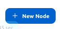
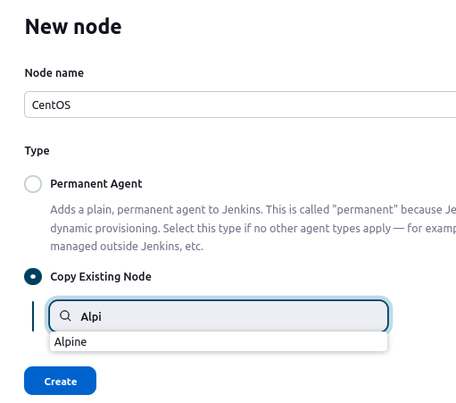

# Configuring agents with Docker

## Add the Alpine, CentOS, Debian and Ubuntu nodes accordingly.

1. Go to **Manage Jenkins** 

  ||
  |:--:|
  |Figure 1 - Manage Jenkins|

2. **Manage nodes and clouds**

  ||
  |:--:|
  |Figure 2 - Manage Nodes and Clouds|

3. Click on **+ New node**

  ||
  |:--:|
  |Figure 3 - New Node|

4. Enter the **Node Name** and click on **Create**

  ||
  |:--:|
  |Figure 4 - Node Name|

  _Jenkins allow to copy from another node to speed up filling up the fields._

5. Select Type **Permanent Agent**
   - Click on **Create**
   - Depending on the node, type the corresponding node name [Alpine || Centos || Debian || Ubuntu]
   - Number of Executors: **3**
   - Remote root directory: `/home/jenkins`. _The reason of this, is because when building the docker images, jenkins user was created within its SSH keys._
   - In lables enter the following:
     - For Alpine controler: **`alpine_controller`**.
     - For the rest of the agents: **`[centos||debian||ubuntu]_worker`**.
   - Usage: **Only build jobs with label expressions matching this node**.
   - Launch method: Launch agents via SSH.

    ||
    |:--:|
    |Figure 5 - Permanent Agent|

6. On Credentials, if this is the first time you input the credential :
  - click on **+ Add**
  - On the Jenkins Credentials Provider: Jenkins Screen.
    - Domain: **Global credentials (unrestricted)**
    - Kind: **SSH Username with pivate key**
    - Scope: **Global (Jenkins, nodes, items, all child items, etc.)**
    - Id: **agent_ssh_jenkins**
    - Description: **Jenkins Agent SSH Private Key**
    - Username: **jenkins**
    - Private Key: **selected**
    - Go to your terminal and open the **`jenkins_key`** file and copy its contents.
    - Go back to the Jenkins Credential screen, and click on the **Add** button. 
    - Paste the private SSH key.
    - **Save**.
    - This takes you back to the previous screen, so choose the ssh credentials just entered.
    - Host Key verification strategy: **Non verifying Verification Strategy**.
    - Availability: **Keep this agent online as much as possible**. 

      ||
      |:--:|
      |Figure 6 - Permanent Agent|

7. At the end you should see the screen with all the agents summary.

    ||
    |:--:|
    |Figure 7 - Permanent Agent|

