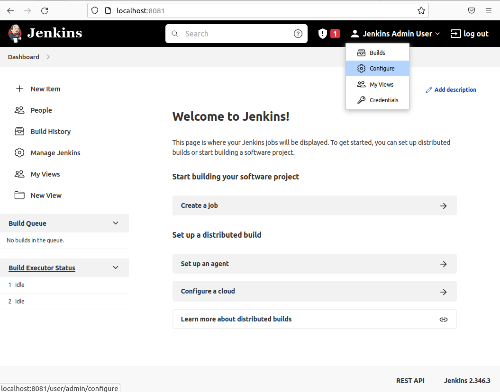
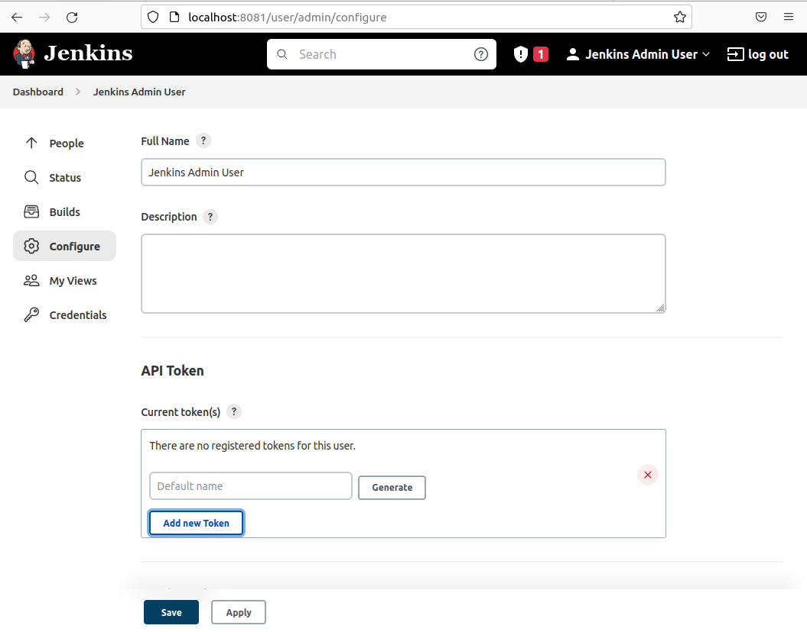
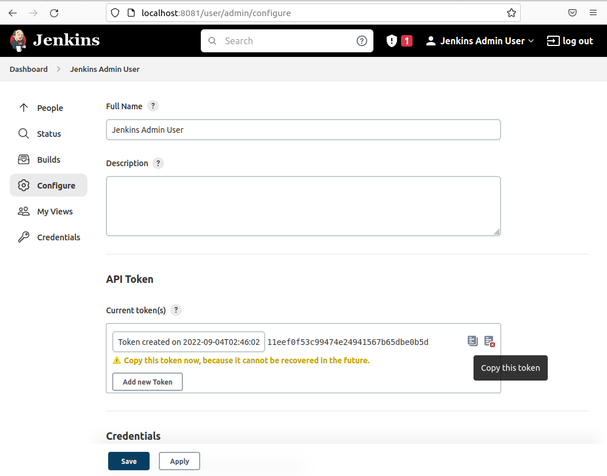
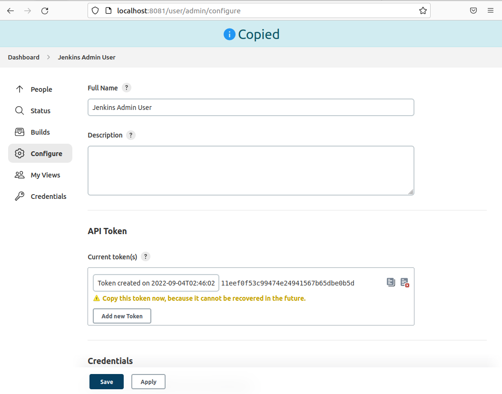
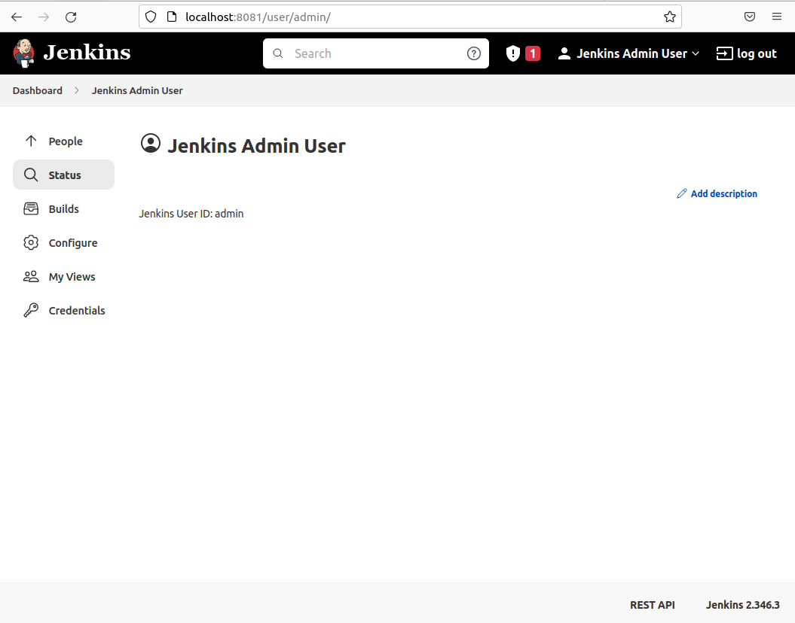

# :information_source: Configure a new API Token
## :paw_prints: Steps
1. Click the **username** on the top right corner on every page.
2. Then click **Configure** to see the username API token.
   
   

3. On the User's configuration page, under **API Token**, click on the **Add new Token** button.
4. After that, click on **Generate**.
   
   

5. Then click on the **Copy** icon next to the generated token. (`11eef0f53c99474e24941567b65dbe0b5d`)
   
   

6. A confirmation page with the **Copied** title is displayed on the top of the page.

   

7. The token like `11eef0f53c99474e24941567b65dbe0b5d` should be now saved.
8. Click on the **Save** button to complete the process.

   

# :books: References
- [Authenticating scripted clients](https://www.jenkins.io/doc/book/system-administration/authenticating-scripted-clients/)