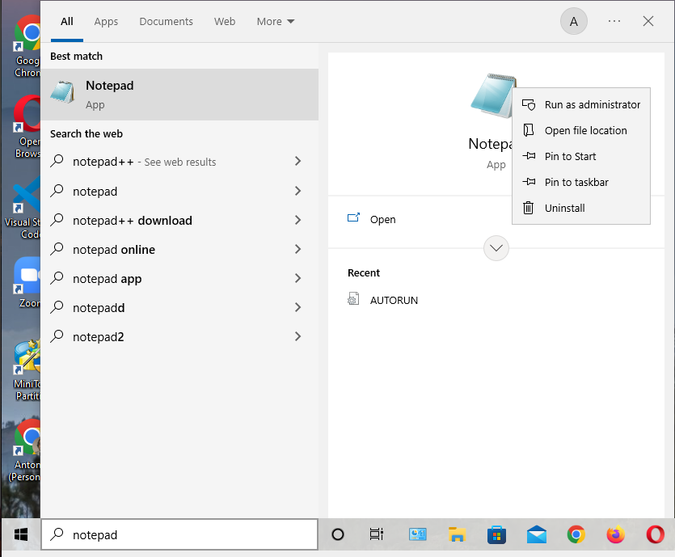
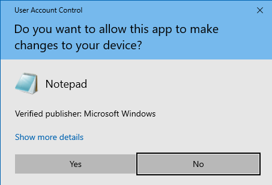
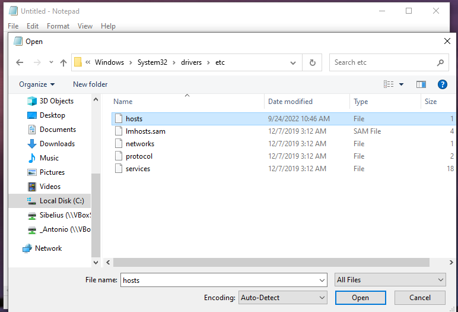
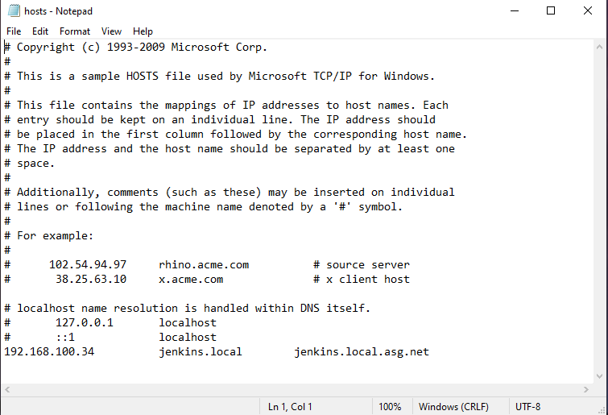

# :notes: Create a Jenkins Docker container
By Antonio Salazar - September 2022

# :paw_prints: Steps
1. Create a new Virtual Machine (_for Windows platforms_).
   - :point_right: [Create a new CentOs 7 VM](https://www.notion.so/Create-a-new-CentOS-7-Virtual-Machine-df777919272643688e30c2f7a9d82ab7)
   - :point_right: [Create a new Ubuntu 22.04 VM]()

2. Setup a local DNS 
   - On Linux and macOS
      ```bash
      # Edit the hosts file
      sudo vi /etc/hosts

      # Input the <ip> <hostname shortname> <full qualifier domain name FQDN>
      127.0.0.1       localhost
      192.168.100.34  jenkins  jenkins.asg.net
      ```

   - On Windows
     - Run Notepad as administrator.

      

    - YES
  
      

     - Go to `C:\Windows\System32\drivers\etc` and open the `hosts` file.

      

     - Edit the `hostfile` and input the `<ip> <hostname shortname> <full qualifier domain name FQDN>`
  

      

     - Save and close.

3. Install Docker on the Virtual Machine just created.

   - :point_right: [Install Docker Engine On CentOS](https://github.com/asgdevops/docker/blob/main/installation/install_docker_engine_on_centos7.md)
   - :point_right: [Install Docker Engine On Ubuntu](https://github.com/asgdevops/docker/blob/main/installation/install_docker_engine_on_ubuntu.md)


4. Set up jenkins user account on the linux host.
 
    ```bash
    # as root user

    # RHEL based
    useradd -m -g wheel -G docker jenkins

    # Debian based
    useradd -m -g sudo -G docker jenkins

    passwd jenkins
    ```

5. Login to the host as jenkins user.

   - if using VM, login to the VM host as jenkins user.
      
   ```bash
   ssh jenkins@jenkins
   # where
   # ssh <user>@<host name or alias>
   ```

   - Otherwise, just switch to jenkins user.
   ```bash
   sudo su - jenkins
   # or
   su - jenkins
   ```
 

6. Set up the environment variables.

   ```bash
   export app_name=jenkins;
   export http_port=8087;
   export network=jnet;
   export jenkins_data=$PWD/${app_name}-data;
   ```

7. Create a working directory on the host.

    ```bash
    # optional steps as jenkins user
    # sudo mkdir -p /app/data
    # sudo chgrp jenkins /app/data
    # sudo chmod g+rwx /app/data
    # cd /app/data

    # as jenkins user
    mkdir -p ${jenkins_data}/jenkins_home
    ```

8. Change the ownership of the `jenkins_home` directory.

    ```bash
    # get the user ID and group ID numbers
    export UID=`id -u $USER`
    export GID=`id -g $USER`
    
    chown $UID:$GID -R ${jenkins_data}/jenkins_home
    ```

9.  **Option 1)** Launch the jenkins instance by Docker command
   
   - Create the Docker bridge network (_in this example namd jnet_)

      ```docker
      docker network create ${network} && docker network ls;
      ```

   - Run the jenkins container by Docker command line
    
      ```docker
      docker run \
      --detach \
      --name ${app_name} \
      --network ${network} \
      --publish ${http_port}:8080 \
      --publish 50000:50000 \
      --rm \
      --user root \
      --volume ${jenkins_data}/jenkins_home:/var/jenkins_home \
      jenkins/jenkins:lts-jdk11
      ```
      
   - :pencil: _**Note:**_ the argument `--user root` is set up to avoit the privileges error below:
  
      ```
      touch: cannot touch '/var/jenkins_home/copy_reference_file.log': Permission denied
      Can not write to /var/jenkins_home/copy_reference_file.log. Wrong volume permissions?
      ```

11. **Option 2)** Launch the jenkins instance by Docker Compose

     - Set up the env variables
       
       ```bash
       tee .env <<EOF
       export app_name='jenkins-lab'
       export http_port=8088 
       export jenkins_data="$PWD/${app_name}-data"
       EOF

       source .env ;
       ```

     - Set up the context
       
       ```bash
       mkdir ${app_name} && cd ${app_name}
       ```

     - Create the [docker-compose.yml](scripts/docker-compose.yml) file
     
       ```yaml
         version: '3'
         services:
            jenkins:
               container_name: ${app_name}
               image: jenkins/jenkins:lts-jdk11
               privileged: true
               ports:
                  - "${http_port}:8080"
               restart: on-failure
               user: root
               volumes:
                  - "${jenkins_data}/jenkins_home:/var/jenkins_home"
               networks:
                  - net

         networks:
            net:
       ```

      - :arrow_up: Run the docker-compose.yml file to launch the Jenkins container.
      
         ```bash
         docker compose up -d 
         ```

      - :arrow_down: Use the command below to stop and remove the docker instance 

         ```bash
         docker compose down
         ```

12. Verify the instance is running.

    ```bash
    docker ps 
    # or 
    docker container ls
    ```

   - In case the instance is running it will show all the container fields,
   - otherwise troublehoot on the issue.

11. Open the Jenkins application on the browser `http://localhost:8080`

    - :pencil: _**Note:**_ the hostname and port number vary depending on the configuration you used. `http:localhost:8080` is the default configuration.

    - Get the Initial Administrator's password.

      ```bash
      docker exec jenkins cat /var/jenkins_home/secrets/initialAdminPassword
      ```

12. :point_right: [Configure Jenkins after installation](../../../../installation/jenkins_install_config.md)

## Troubleshooting
In case the Docker jenkins container is not running, verify the logs:

```bash
docker logs ${app_name}
```

<br/>

# :bookmark_tabs: Table of Contents
- :link: [Creating a simple Jenkins Lab on a Docker Container](jenkins_install_macos.md)
- :link: [Running Jenkins on a container using scripts](app/jenkins_base/README.md)

# :books: References
- :link: [Installing Jenkins - Docker](https://www.jenkins.io/doc/book/installing/docker/)

