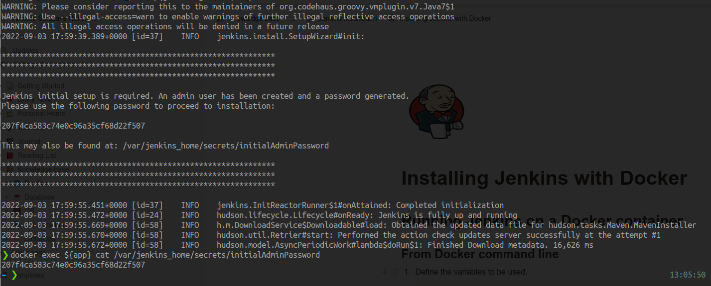
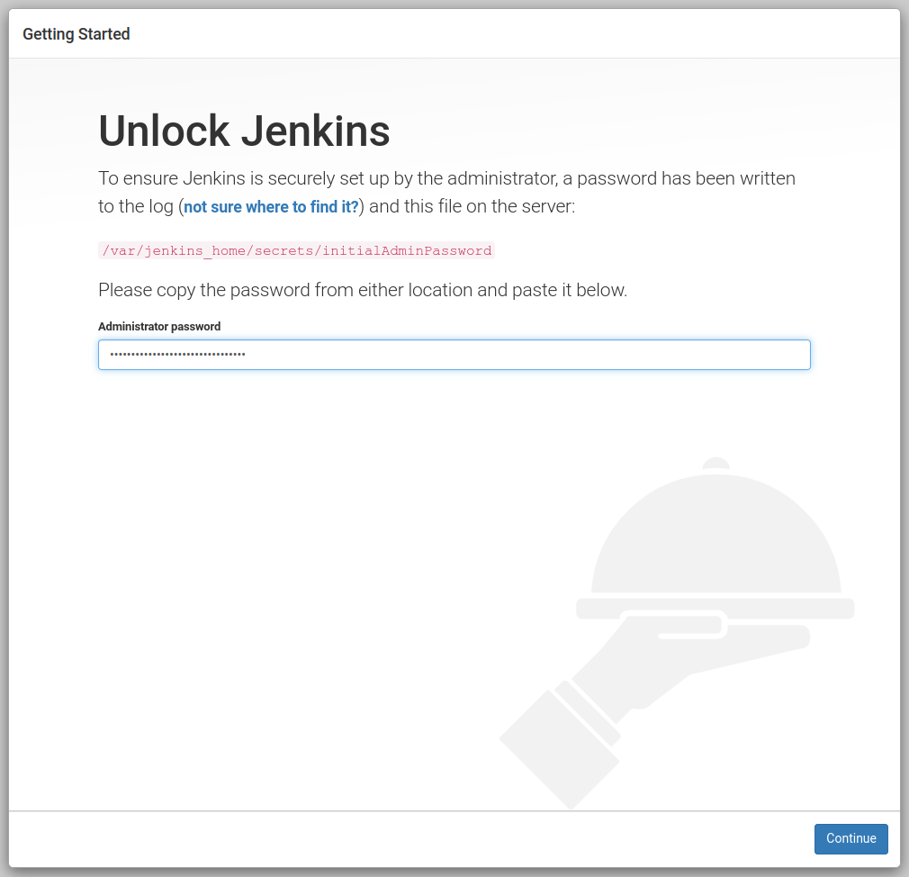
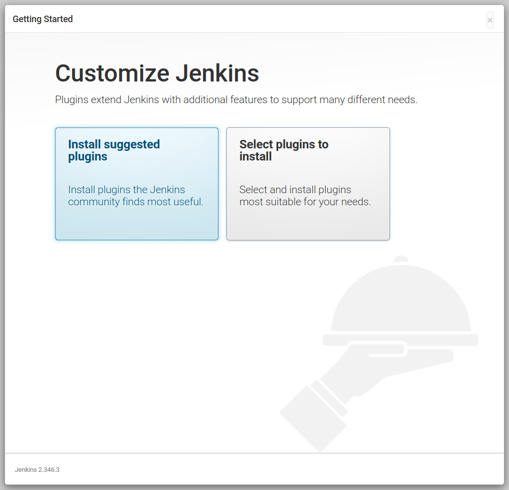
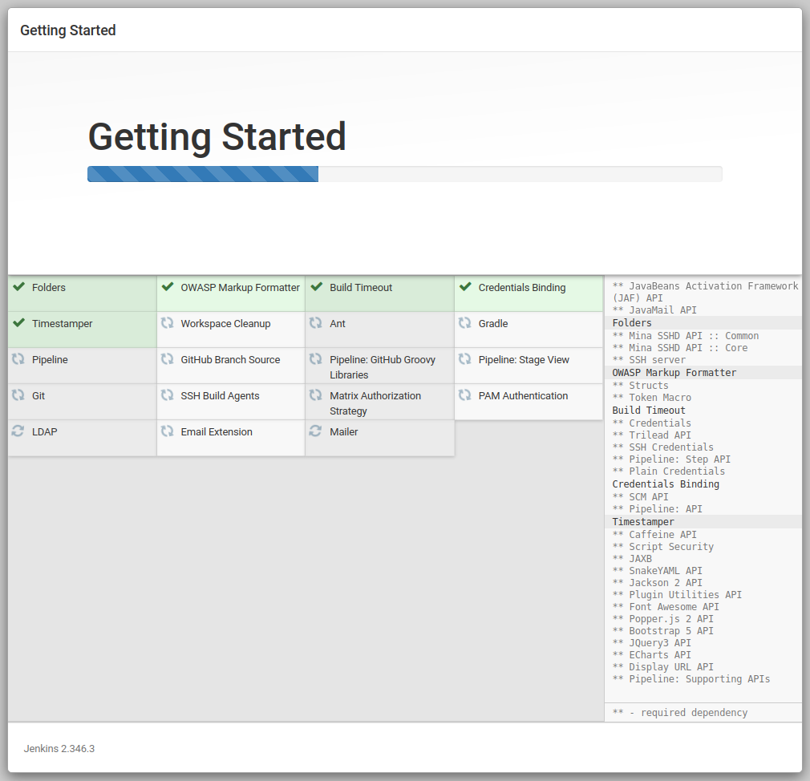
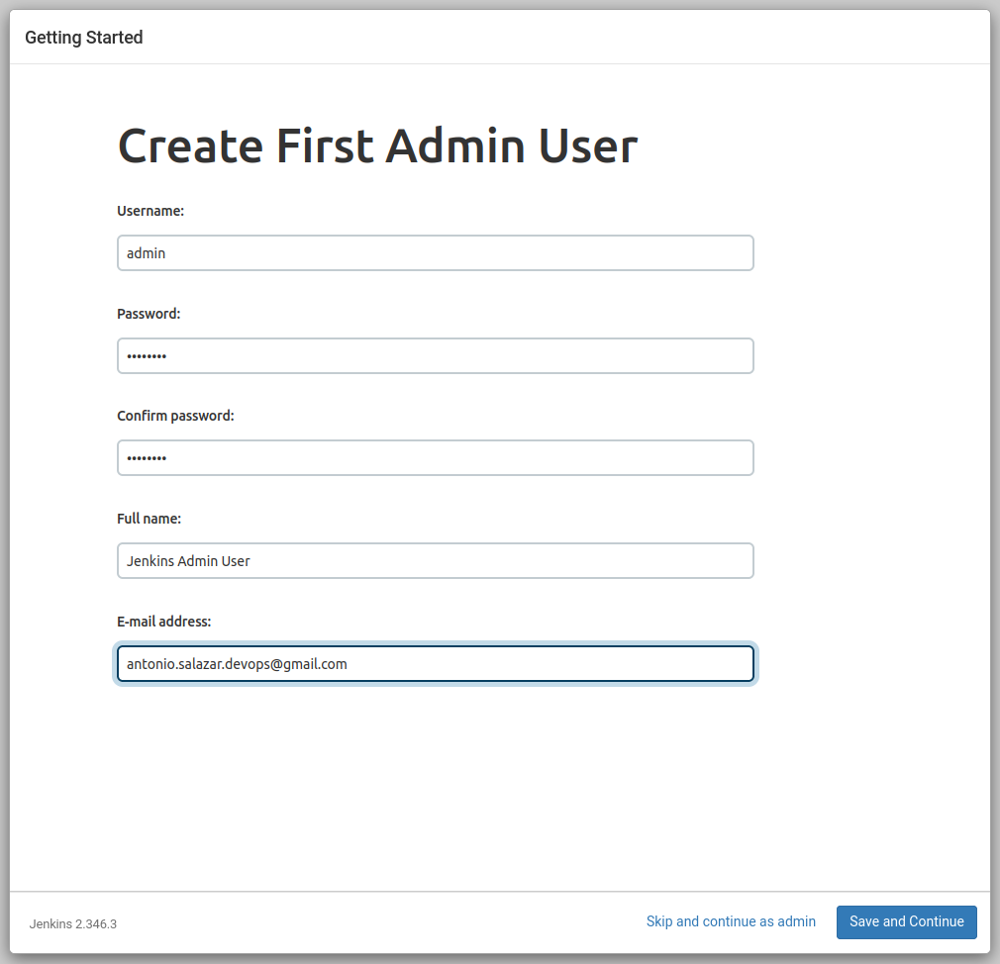
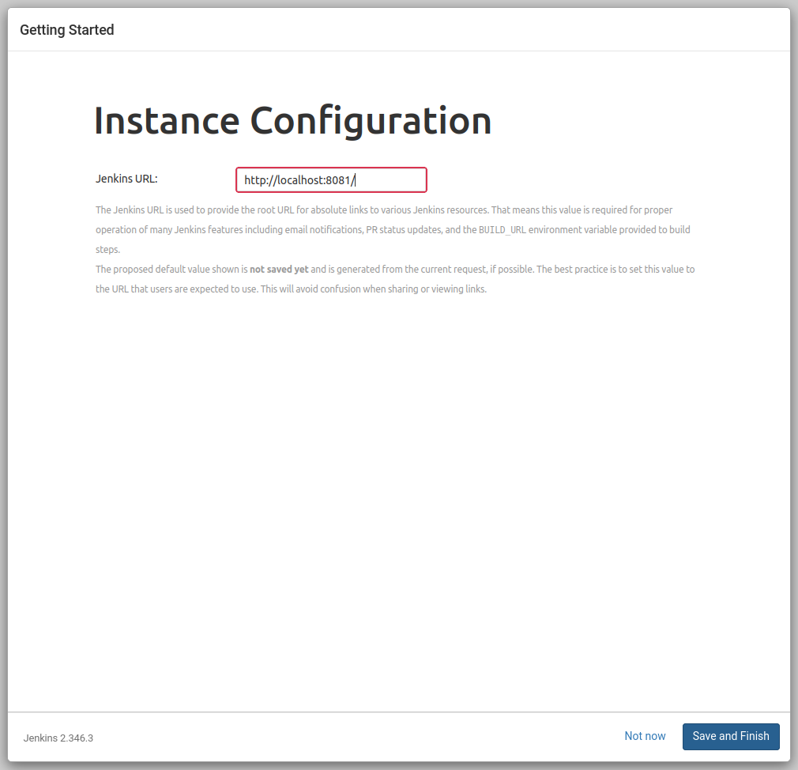
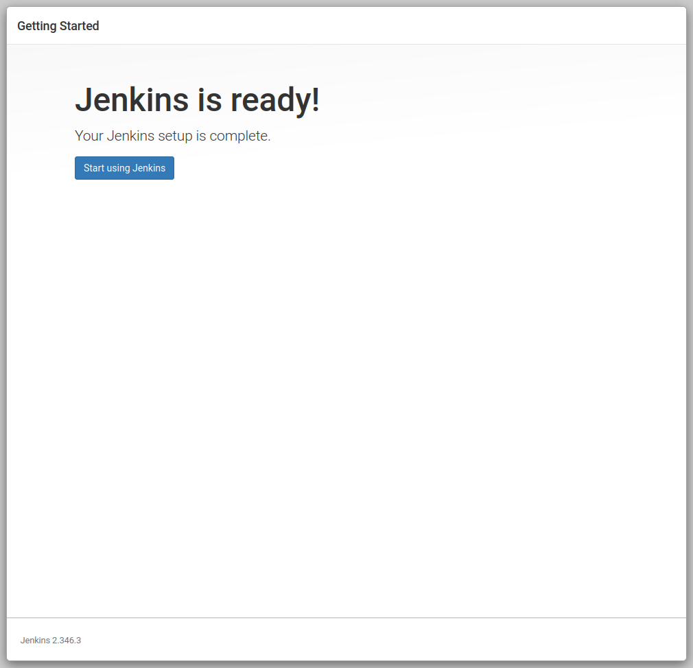
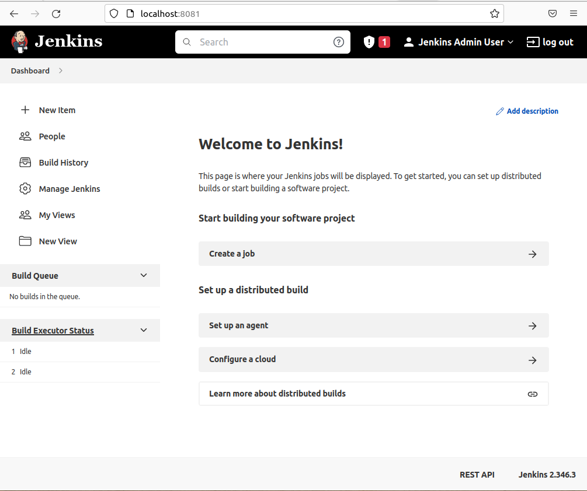

# :notes: Configure Jenkins after installation
## :paw_prints: Steps

1. Take the Initial Admin Password  from the `/var/jenkins_home/secrets/initialAdminPassword` file.
    
    ```bash
    cat /var/jenkins_home/secrets/initialAdminPassword
    ```
    
    
    
2. Open a browser to `http://localhost:${port}` address.
3. Input the Initial Admin Password and click on **Continue**.
    
    
    
4. Click on the **Install suggested plugins.**
    
    
    
5. The installation process will start and take some time to complete.
    
    
    
6. Provide the **Admin** **username**, **password**, **full name**, and **email** data. 
    
    
    
7. Setup the Jenkins URL address.
    
    
    
8. The **Jenkins is Ready!** confirmation screen is displayed. Proceed to start using Jenkins.
    
    
    
9. After the **Welcome to Jenkins!** page is shown.
    
    

# :books: References

- [Installing Jenkins official documentation.](https://www.jenkins.io/doc/book/installing)
- [Jenkins installation notes](README.md).